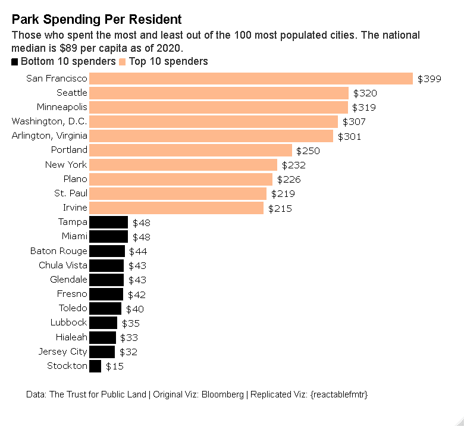

# Park Scores

The dataset comes from [The Trust for Public Land](https://www.tpl.org/parks-and-an-equitable-recovery-parkscore-report).

# Created with the {reactablefmtr} package:

## Animated Chart:

## Static Chart:

