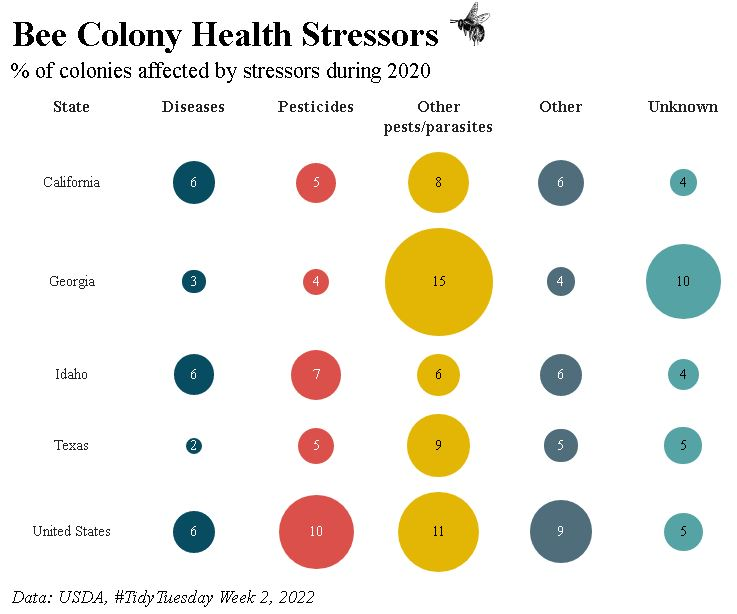

## Bee Colonies
The data this week comes from the USDA, hat tip to Georgios Karamanis.

This report provides information on honey bee colonies in terms of number of colonies, maximum, lost, percent lost, added, renovated, and percent renovated, as well as colonies lost with Colony Collapse Disorder symptoms with both over and less than five colonies. The report also identifies colony health stressors with five or more colonies. The data for operations with honey bee colonies are collected from a stratified sample of operations that responded as having honey bees on the Bee and Honey Inquiry and from the NASS list frame. For operations with five or more colonies, data was collected on a quarterly basis; operations with less than five colonies were collected with an annual survey.

## Data Visualization

The data visualization below was created with the {reactablefmtr} package using the `bubble_grid()` formatter.

